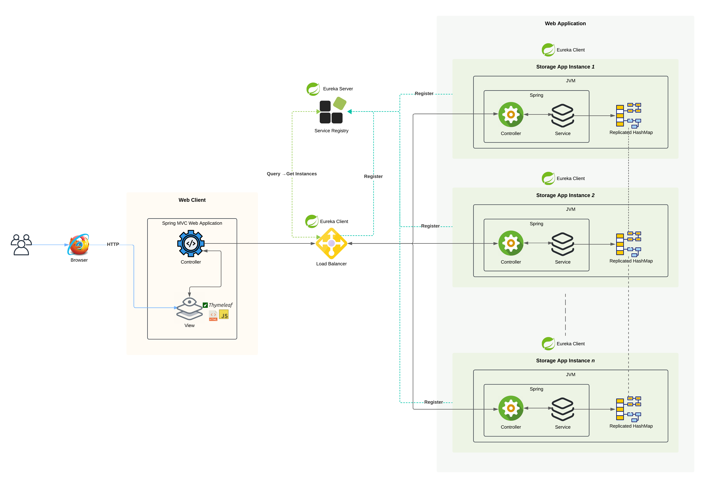

# Patterns of Distributted Systems

## Summary

The main idea of this lab is to build a basic robust distributed system that demonstrates the key principles of scalability, fault tolerance, and dynamic service discovery. A replicated key-value store capable of handling node failures and dynamically accommodating new nodes is implemented, ensuring state consistency across the system. It also includes the creation of a simple web application that allows clients to register their names, with data stored in the replicated structure along with timestamps.

The architecture incorporates a load balancer, implemented in Spring, that uses a round-robin strategy to evenly distribute requests across the backend services responsible for data storage. Additionally, a service discovery mechanism will allow backend services to register themselves, allowing the load balancer to dynamically track available instances. Basically, it demonstrates in a practical way the creation of a resilient, real-time system with distributed data handling, load balancing, and service discovery.

## Features

#### Java
```
Java version: 17
```

#### Spring Context

- Web Client: Thymeleaf as a template engine
- Service Discovery: Spring Cloud Eureka to register and locate microservices

### Run Instructions

1. Clone this repository:
```
git clone https://github.com/nduran06/AYGO-Lab2-Distributed-patterns.git
```
2. Start **Service Registry** (*port* 8325):
```
cd AYGO-Lab2-Distributed-patterns ; cd serviceRegistry ; mvn spring-boot:run
```
3.  Start **Load Balancer** (*port* 8764):
```
cd AYGO-Lab2-Distributed-patterns ; cd loadBalancer ; mvn spring-boot:run
```
4.  Start **Storage Node(s)** (*port* ***random*** *or assign it yourself: 8081, 8082, ...*):

* Execution with specific port
```
cd AYGO-Lab2-Distributed-patterns ; cd nodeStorageApp ; mvn spring-boot:run -Drun.arguments="--server.port=<port>"
```

* Execution with random port
```
cd AYGO-Lab2-Distributed-patterns ; cd nodeStorageApp ; mvn spring-boot:run"
```

5.  Start **Web Client** (*port* 3000):
```
cd AYGO-Lab2-Distributed-patterns ; cd webClient ; mvn spring-boot:run
```

## Architecture



### Components

#### 1. Service Registry

- **Location:** [Service Registry](https://github.com/nduran06/AYGO-Lab2-Distributed-patterns/tree/main/serviceRegistry "serviceRegistry")
- **Purpose:** Acts as a central registry for all services, providing service registration and discovery capabilities. It monitors the status of each service and maintains an up-to-date record of available services.

#### 2. Load Balancer

- **Location:** [Load Balancer](https://github.com/nduran06/AYGO-Lab2-Distributed-patterns/tree/main/loadBalancer "loadBalancer")
- **Purpose:** Handles request distribution and routing by distributing incoming requests across storage nodes using the round-robin technique. It also facilitates service discovery through Eureka and acts as a single entry point for client requests.

#### 3. Storage Nodes 

- **Location:** [User Storage App](https://github.com/nduran06/AYGO-Lab2-Distributed-patterns/tree/main/nodeStorageApp "nodeStorageApp")
- **Purpose:** Serves user requests and manages data storage, handling WebSocket connections, replicating data between nodes, and transmitting real-time updates.

#### 4. Web Client:

- **Location:** [Web Client App](https://github.com/nduran06/AYGO-Lab2-Distributed-patterns/tree/main/webClient "webClient")
- **Purpose:** Provides the user interface, presenting a registration form, handling asynchronous requests, and dynamic content updates to improve user interaction.

#### Test run video (Spanish)
[](https://pruebacorreoescuelaingeduco-my.sharepoint.com/:v:/g/personal/natalia_duran-v_mail_escuelaing_edu_co/EQB7ol7zS-9OjN9ylLVW-7kBpa2fvzybkIYYBjPqZbcDJw?nav=eyJyZWZlcnJhbEluZm8iOnsicmVmZXJyYWxBcHAiOiJPbmVEcml2ZUZvckJ1c2luZXNzIiwicmVmZXJyYWxBcHBQbGF0Zm9ybSI6IldlYiIsInJlZmVycmFsTW9kZSI6InZpZXciLCJyZWZlcnJhbFZpZXciOiJNeUZpbGVzTGlua0NvcHkifX0&e=KQvCg2)


